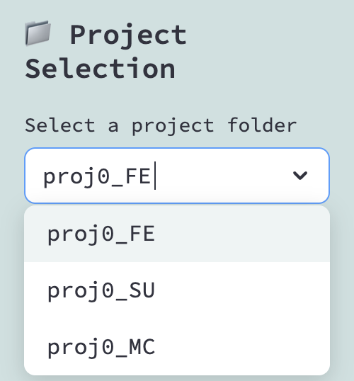
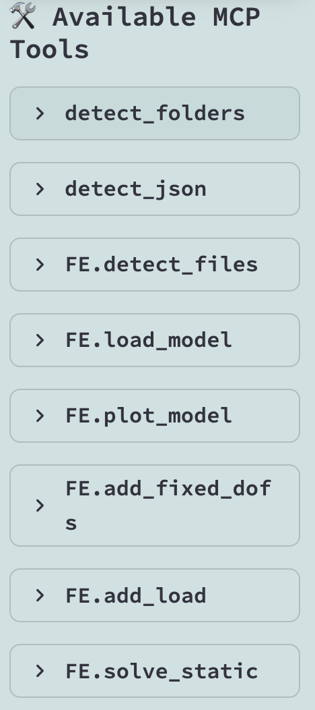
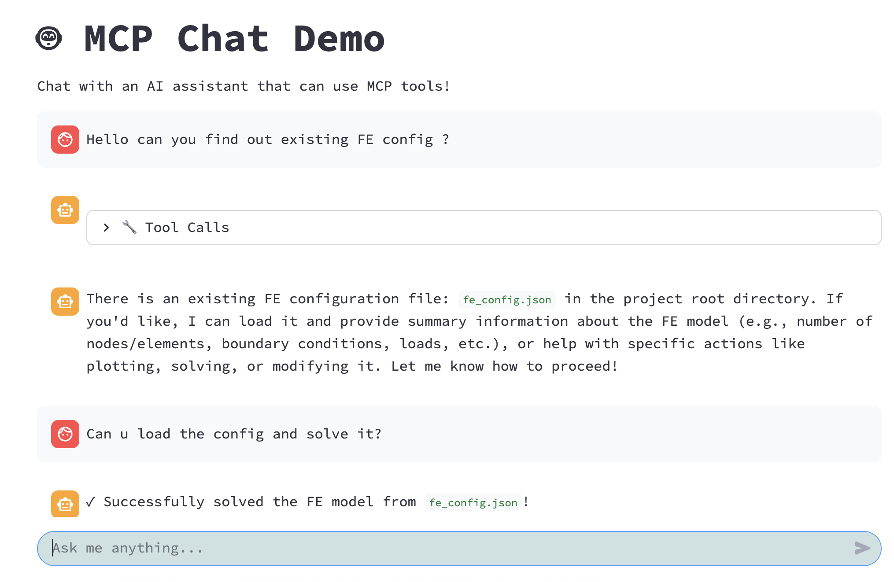
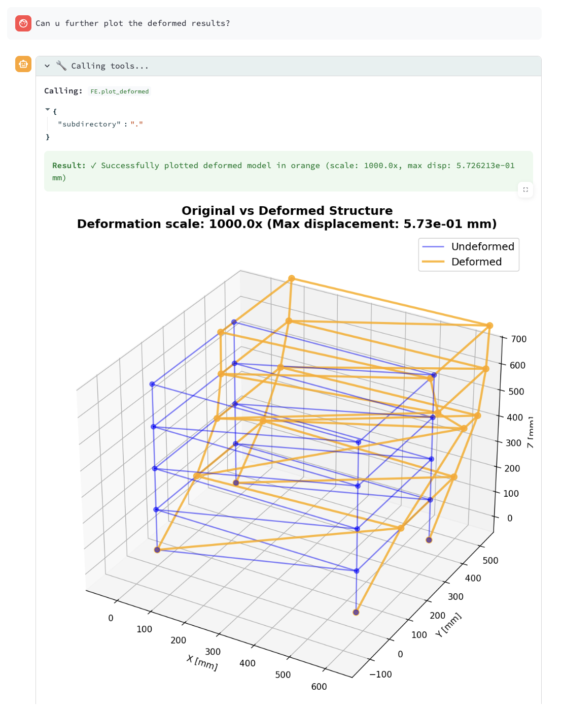

# Chat4MonteCarlo

This repository provides example projects with MCP (Model Context Protocol) servers for LLM integration. 
The MCP servers enable LLMs to perform Monte-Carlo simulation-based tasks in science and engineering topics.


## 📦 Installation

For dependencies in Python, the packages can be added from pip using:
```bash
pip install -r requirements.txt
```

If using `uv` as the virtual environment manager, please run:
```bash
uv pip install -r requirements.txt
```

## 🚀 Quick Start

Please include a `.env` file at the repository root. The `.env` file should include the OpenAI-compatible API format:
```bash
# Get your API key from OpenAI or other providers
OPENAI_API_KEY=sk-your-api-key-here
OPENAI_MODEL=gpt-4o-mini
OPENAI_BASE_URL=https://theAIprovider.com
```

#### 🔍 Check API Key (Optional)

To test your API key validity manually:

```bash
python test_api_key.py
```

The API key should be in **"OpenAI-compatible"** format.

Simply run the app - it will show a user-friendly web-app interface:

```bash
streamlit run app.py
```

After running the UI app from the command line, the UI app will be shown as a web page in the browser.

The UI allows the user to focus on the project of interest. The working project can be re-selected, and the corresponding MCP tools will be loaded for the LLM. The **project selection** is currently set at the top of the sidebar. 



After selecting the project, at the sidebar, the available mcp tools within that working dictionary can be found as



After navigating into the exact project, the user can start to work with LLM for project work. The main chat interface is on the right-hand side of the sidebar.



In the demo project of `proj0_FE`, the finite element solving can be executed by LLM. The graphical results can be visualized by the AI assistant through functional calls.




## 🔐 Security Features

This project includes **.env encryption** with three security levels:

1. **Unencrypted** (⚠️): For testing only
2. **Password-protected** (🔒): AES-256 encryption with password
3. **2FA-protected** (🔐): AES-256 + password + TOTP authenticator

**Quick Commands:**
```bash
# Manual encryption (advanced users)
python encrypt_env.py encrypt           # Password-only encryption
python encrypt_env.py decrypt           # Decrypt with password
python encrypt_env.py setup-2fa         # Setup 2FA (one-time)
python encrypt_env.py encrypt --2fa     # Encrypt with password + 2FA
python encrypt_env.py decrypt --2fa     # Decrypt with password + 2FA
python encrypt_env.py verify-2fa        # Test your 2FA code
python encrypt_env.py disable-2fa       # Remove 2FA (keep password)
```


## 📁 Repository's Structure

This repository contains:

- **`app.py`** - Main Streamlit application with MCP client integration
- **`encrypt_env.py`** - Environment file encryption tool with password and 2FA support
- **`proj0_FE/`** - Finite Element analysis example project with MCP server
- **`proj0_MC/`** - Monte Carlo simulation example project with MCP server
- **`proj0_SU/`** - Surrogate modeling example project with MCP server
- **`pySMC/`** - Core Python package for Sequential Monte Carlo methods (added from another project --> [pySMC](https://github.com/Hugo-build/pySMC) 
- **`requirements.txt`** - Python package dependencies

Each example project (`proj0_*`) includes its own MCP server (`server.py`) that exposes specialized tools for LLM integration.


## 🎩 Customized Theme

The chat-UI is built on top of "Streamlit" web-UI framework. It allows customization of the theme. To customize your theme, you can add a "config.toml" in the `.streamlit` folder at this repository's path. 
 
The `.config.toml` should look like:
```toml
[[theme.fontFaces]]
family="noto-sans-light"
url="app/static/NotoSans-Light.ttf"
style="normal"


[theme]
base="light"
primaryColor="#4b9fff"
secondaryBackgroundColor="#CDE0E0"
font="noto-sans-light"


[server]
enableStaticServing = true
```

Currently, the template at this repository allows modification of the theme colors and the font style. 


## 📜 Credentials

### License

This project is licensed under the **Polyform NonCommercial License 1.0.0** - see the [LICENSE](LICENSE) file for details.

**In summary:**
- ✅ Free for academic research and personal use
- ✅ Modifications and redistribution allowed (non-commercially)
- ❌ Commercial use requires separate permission

### Citation

If you use this project in your research, please cite:

```bibtex
@software{chat4montecarlo2025,
  author       = {Yu Ma},
  title        = {Chat4MonteCarlo: LLM-Integrated Monte Carlo Simulation Framework for engineering science},
  year         = {2025},
  publisher    = {GitHub},
  url          = {https://github.com/Hugo-build/chat4MonteCarlo},
  note         = {University of Stavanger}
}
```

Or in text format:
> Yu Ma (2025). Chat4MonteCarlo: LLM-Integrated Monte Carlo Simulation Framework for engineering science. University of Stavanger. https://github.com/Hugo-build/chat4MonteCarlo

### Contributing

Contributions are welcome! Please follow these guidelines:

1. **Fork** the repository
2. **Create** a feature branch (`git checkout -b feature/your-feature`)
3. **Commit** your changes with clear messages
4. **Push** to your branch and open a **Pull Request**

Please ensure your contributions:
- Follow the existing code style
- Include appropriate documentation
- Do not introduce breaking changes without discussion

### Acknowledgments

- Built on [FastMCP](https://github.com/jlowin/fastmcp) for MCP server implementation
- UI powered by [Streamlit](https://streamlit.io/)
- [pySMC](https://github.com/Hugo-build/pySMC) for Sequential Monte Carlo methods

### Contact

For questions, collaborations, or commercial licensing inquiries, please contact.
